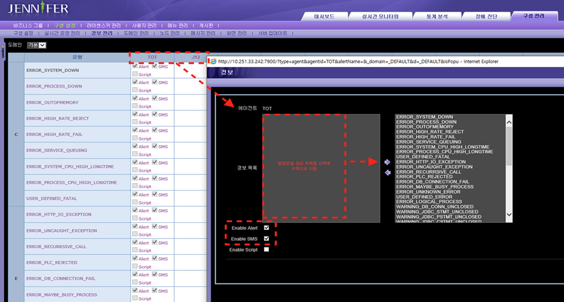

# 3.4.23 Jennifer4

Jennifer4をAlertNowに接続する方法を説明します。AlertNowに接続するには、Jennifer4で必要なアダプタを設定します。


1. AlertNowコンソール&#x3067;**【インテグレーション作成】**&#x30DC;タンをクリックし、**【Jennifer4】**&#x30AB;ードを選択します。

<figure><figcaption></figcaption></figure>

2. インテグレーション作成画面で必須項目を入力した後、**【確認】**&#x30DC;タンを押すとインテグレーションが作成されます。

<figure><figcaption></figcaption></figure>

3. アダプタ設定に使用するために、作成されたインテグレーションURL情報をクリップボードにコピーします。

<figure><figcaption></figcaption></figure>

[AlertNow用 Jennifer4 Adapterのダウンロード](http://./resource/AlertNowNotiAdapter.java)


Jennifer4をAlertNowに接続するために、AlertNow用Jennifer4アダプタをダウンロードします。Jennifer4はJennifer5バージョンとは互換性がありません。


**● AlertNowとインテグレーション可能なJDKバージョン情報**

&#x20;

① jdk 1.5: 使用不可

② jdk 1.6: 使用不可

③ jdk 1.7: 使用可能 (7 \~ 7u80, OpenJDK含む)

④ jdk 1.8: 使用可能 (8 \~ 8u241, OpenJDK含む)

&#x20;

Jennifer4はJDK 1.5バージョンから1.8バージョンまでをサポートしますが、AlertNowに接続するには1.7バージョン以上が必要です。


## **Adapter設定**

1. 稼働中のJenniferサーバーを/{Jennifer4 Server Home}/binの./shutdown.shを実行して停止します。


2. vi EditorまたはテキストエディタでAlertNowNotiAdapter.javaファイルを開きます。編集後、必ずUTF-8で保存し、他の変更が加わらないように注意します。エンコーディングが変更されると、ソースファイルがコンパイルされない可能性があります。


3. 以下のように、AlertNowNotiAdapter.javaファイル内のprivate static final String ALERTNOW\_JENNIFER\_INTEGRATION\_URL項目に、コピーしたAlertNowインテグレーションURL情報を貼り付けます。


Webhook URL情報以外は変更しないでください。他の情報が変更されると、AlertNowとの連携が正常に行われなくなる可能性があります。


<figure><figcaption></figcaption></figure>


4. 編集したAlertNowNotiAdapter.javaファイルをインストールされているJennifer4サーバーの/{Jennifer4 Server Home}/common/libに移動します。

<figure><figcaption></figcaption></figure>

5. /{Jennifer4 Server Home}/common/libにjenniferserver.jarファイルがあるか確認します。このファイルにAlertNowNotiAdapter.javaファイルをマージする必要があるため、ファイルがない場合はサーバー管理者やJenniferに問い合わせてください。


6. jenniferserver.jarファイルがある場合は、AlertNowNotiAdapter.javaファイルをその場所に移動し、以下のコマンドを使用してマージを開始します。

```
⑴  javac -d . -cp ./jenniferserver.jar AlertNowNotiAdapter.java
⑵  jar uvf jenniferserver.jar ./com
```

7. javacコマンドを実行すると、/{Jennifer4 Server Home}/common/libにはcomディレクトリが作成され、そのディレクトリにAlertNowNotiAdapter.javaのclassファイルが配置されます。

&#x20;

8. javacコマンドを実行してclassファイルが正常に作成された後、jar uvfコマンドを実行してソースコードをマージします。

&#x20;

9. AlertNowNotiAdapter.javaファイルをマージした後、/{Jennifer4 Server Home}/binに移動します。vi Editorまたはテキストエディタでjennifer.propertiesファイルを編集します。以下のように、sms\_adapter\_class\_nameをcom.javaservice.jennifer.server.AlertNowNotiAdapterに修正する必要があります。

```
sms_adapter_class_name = com.javaservice.jennifer.server.AlertNowNotiAdapter
```

&#x20;

10. sms\_adapter\_class\_nameはAuto-notificationとCustomizeにあり、必ずどちらか一方だけを有効にして修正する必要があります。両方を修正すると、どちらも動作しません。

&#x20;

11. /{Jennifer4 Server Home}/binで./startup.shを実行してJennifer4サーバーを起動します。Jennifer4で発生する警告をAlertNowNotiAdapterと連携させるには、以下のように警告とSMS設定を行います。構成設定の警告管理で、タイプ項目にTOTとAgentのIDが表示されたら、IDをクリックして警告設定を行います。警告リストを選択し、右側に移動した後、Enable AlertとEnable SMSを必ず選択します。

&#x20;

a. Jennifer4の外部連携インターフェースはSMSのみであり、AlertNow Adapterはこのインターフェースを通じて動作するため、Enable SMSが設定されていないとAlertNowと連携できません。

&#x20;

b. Enable AlertおよびEnable SMSが有効になっていない場合、その警告リストはWeb Monitoringでのみ確認でき、外部連携は行われません。


<figure><figcaption></figcaption></figure>

12. Adapterの動作ログは/{Jennifer4 Server Home}/logs/catalina.outで確認できます。

<figure><figcaption></figcaption></figure>

\
